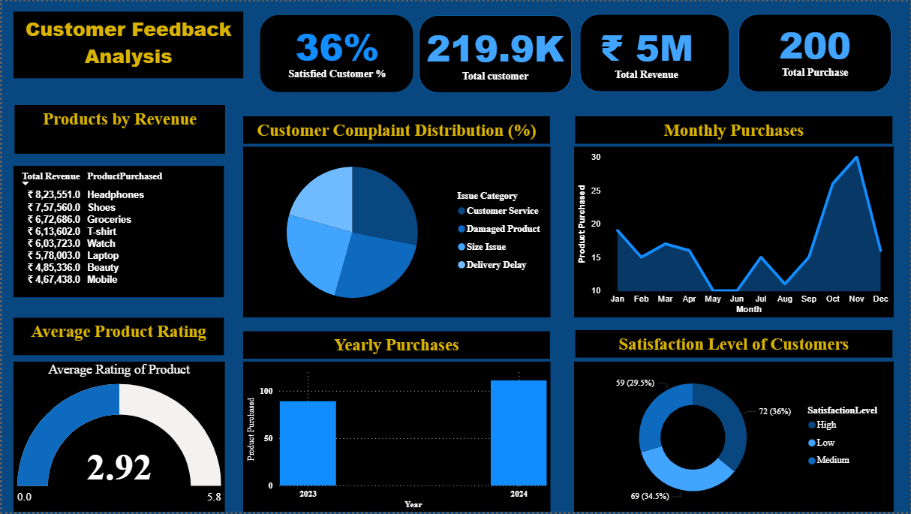
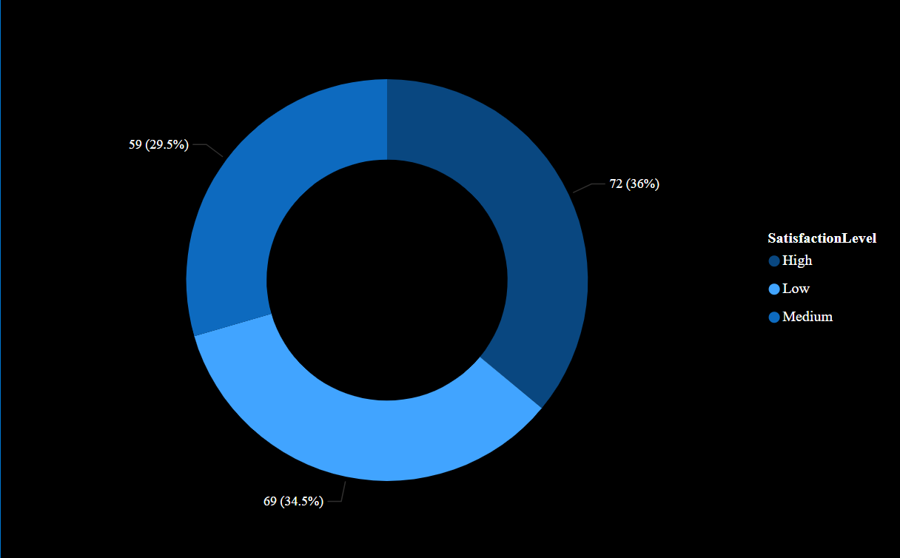
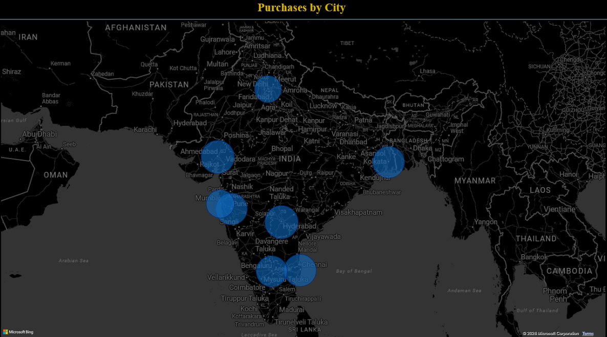
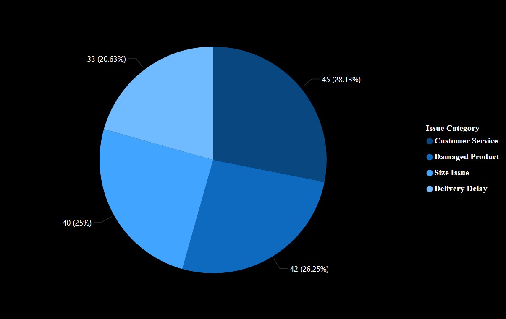
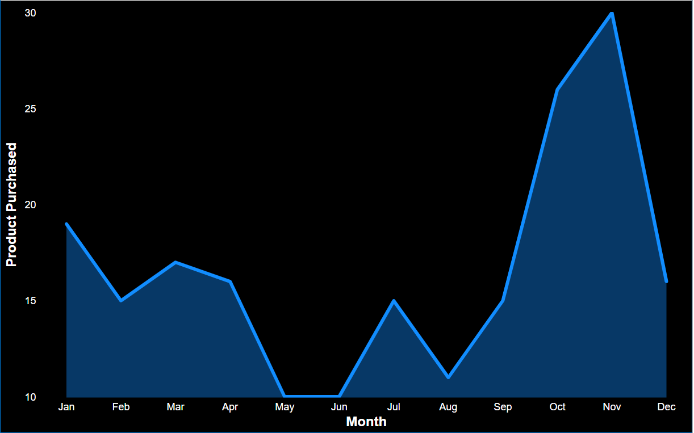

# Customer-Feedback-Analysis-PowerBI
Customer Feedback Analysis Dashboard built using Power BI to identify customer satisfaction trends, key drivers, and business insights.
# Customer Feedback Analysis Dashboard

## Project Overview

This project analyzes customer feedback data using Power BI to identify satisfaction trends, customer sentiment patterns, and actionable business insights.

The dashboard helps businesses understand customer experiences and make data-driven decisions to improve service quality.

---

## Objectives

* Analyze customer satisfaction levels
* Identify key factors affecting customer experience
* Track monthly revenue trends
* Generate actionable business recommendations

---

## Tools Used

* Power BI
* Excel
* DAX
* Power Query

---

## Dataset

The dataset contains customer feedback records including:

* Customer Ratings
* issue Categories
* Satisfaction Level
* Dates
* Product Rating

---

## Dashboard Features

### KPI Metrics

* Total Purchase
* Average Rating
* Customer Satisfaction Score
* Total Revenue

### Analysis Pages

* Customer Satisfaction Analysis
* Monthly Revenue Trends
* Customer Complaint Distribution Analysis

---

## Dashboard_Overview

## Customer_Satisfaction

## Purchase By City

## Customer_Complaint_Distribution

## Monthly_Trends

---

## Key Insights

1. Only 36% customer are categorised as satisfied.
2. Service-related complaints represented the largest share of negative feedback.
3. Average product rating is 2.92/5, indicating moderate customer satisfaction and room for improvement.
4. Electronics products dominate revenue contribution.
---

## Business Recommendations

* Improve response time for customer issues.
* Focus on high-complaint categories.
* Monitor satisfaction trends monthly.
* Strengthen customer engagement initiatives.

---

## Author

Khushi Naagar

Aspiring Data Analyst | Power BI | SQL | Python | Excel
